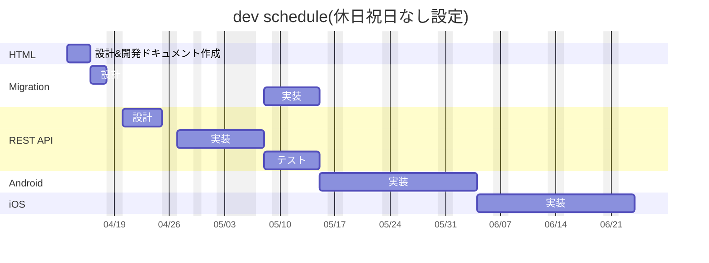

```mermaid
gantt
    title dev schedule(休日祝日なし設定)
    dateFormat YYYY-MM-DD
    axisFormat  %m/%d
    excludes weekends 2020-04-29  2020-05-02 2020-05-03 2020-05-04 2020-05-05 2020-05-06 2020-07-23 2020-07-24 2020-08-10 2020-09-21 2020-09-22 2020-11-03 2020-11-23
    section HTML
        設計&開発ドキュメント作成: design_and_doc, 2020-04-13, 3d

    section Migration
        設計: desgin_migration, after design_and_doc, 2d
        実装: imple_migration, after imple_api, 5d

    section REST API
        設計: design_api, after desgin_migration, 5d
        実装: imple_api, after design_api, 5d
        テスト: test_api, after imple_api, 5d

    section Android
        実装: imple_android, after test_api, 2w

    section iOS
        実装: imple_ios, after imple_android, 2w
```